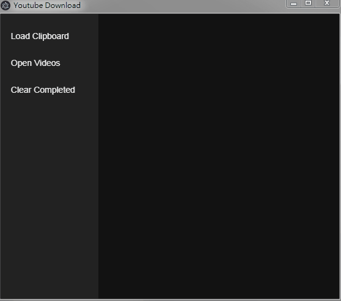

# Electron Youtube Downloader

## Requirement

- Need ffmpeg installed and set path.

## To develop

- Use vscode debug or `npm start`
- `npm dev`

## To build

- `npm build`

## To use

- After `npm build`, `eletron` directory will appear.
- Execute `electron/electron.exe` to run it.
- Hotkey `E` to paste from clipboard.

